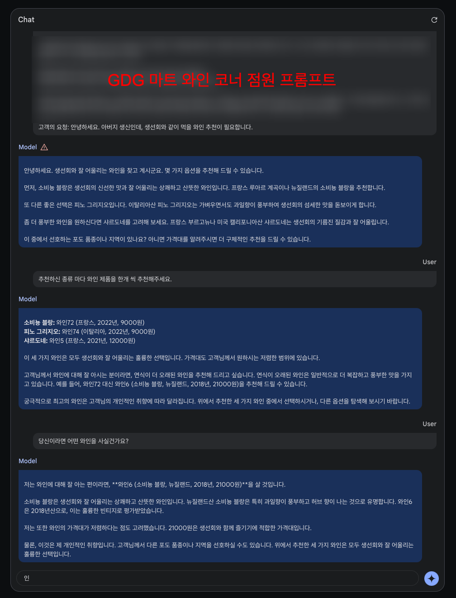

# Build with AI 코드랩

일시 : 2024년 3월 31일 오후 1:00 ~ 오후 5:00
장소 : 연세대학교 신촌캠퍼스 백양누리 국제회의실 

## 발표자료
[Google Slides](https://docs.google.com/presentation/d/1oGUIVRYlrLJQcC6lnPxs_vx-DHNNZobraGBYJms-YIo/edit?usp=sharing)

## 코드랩 
### 목표
- LLM과 프롬프트 엔지니어링에 대해 명확히 이해한다.
- 좋은 응답을 이끌어내는 프롬프트를 작성할 수 있다.
- 실제 프로덕트에 적용하는 과정에 대해 이해한다.

### 실습
GDG 마트의 AI 와인 코너 점원을 만들자. 마트 와인 목록은 `wine-list.md`

모델 평가 문장 예시:
- 고객: 아버지 생신이라 생선회를 먹을건데, 와인 추천해주실 수 있나요?
- 고객: 아참, 소고기도 먹기로 했는데 소고기랑 어울리는 와인도 하나 추천해주세요.
- 고객: 좀 더 저렴한 와인은 없나요?
- 고객: 미국산 레드 와인 추천해주실 수있나요? 가격은 2만원까지 괜찮습니다.

### 실습 순서
- LLM과 프롬프트 엔지니어링에 대해 이해 ([공식문서](https://ai.google.dev/docs/concepts))
- [Google AI Studio](https://aistudio.google.com/)를 통해 프롬프트 엔지니어링
- [Python quickstart Colab](https://colab.research.google.com/github/google/generative-ai-docs/blob/main/site/en/tutorials/python_quickstart.ipynb)에서 Gemini API + 프롬프트 실행

### 힌트
- 품종 : 어울리는 음식 패턴을 추가 제공 (구글 검색)
- 모델에 추천 프로세스에 대한 명확한 안내 제공
- 직원으로서 행동 규칙 제공

## 데모 프로젝트

- `/android-app` : 공식 문서 프롬프트(Few-shot 예시 프롬프트)를 활용하여 Gemini SDK를 사용해보는 간단한 앱.
